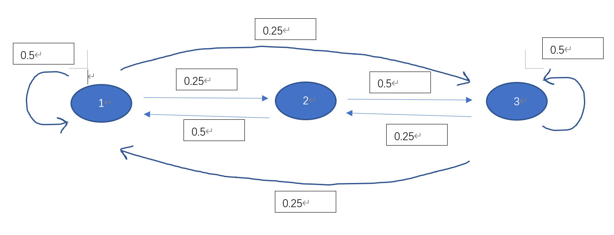

## Question 1  

**(a)**  


$$

\begin{eqnarray}
\begin{pmatrix}
0.5 & 0.25 &  0.25&\\
0.5 & 0 & 0.5 \\
0.25 & 0.25&0.5 \\
 
\end{pmatrix} 
\end{eqnarray}

$$
 
**(b)**  
p(rainy in two days)=  0.25x0.5 + 0.25x0.5 + 0.5x0.25=0.125+0.125+0.125 = 0.375  
p(cloudy in two days)=  0.25 x 0.25 + 0.25x0 + 0.5x0.25=0.0625+0+0.125= 0.1875  
p(sunny in two days)=  0.25x0.25 + 0.25x0.5 + 0.5x0.5 = 0.0625 + 0.125 + 0.25 = 0.4375 
So the expected weather is sunny.  


**(c)**   
Yes, it is irreducible because there is at least one path between each two states, so all states communicate with each other. 
The stationary distribution is:  
$$

\begin{eqnarray}
\pi_1 = 0.5\pi_1 + 0.5\pi_2 +0.25\pi_3\\

\pi_2 = 0.25\pi_1 + 0*\pi_2 +0.25\pi_3\\

\pi_3 = 0.25\pi_1 + 0.5\pi_2 +0.5\pi_3\\
1 =\pi_1 + \pi_2 +\pi_3\\
\pi_1 = 0.4,\pi_2=0.2,\pi_3=0.4

\end{eqnarray}

$$


## Question 2   
Each state communicates with each other, so it is irreducible.  
state 0 can do self-looping, and every other state communicates with state 0, so all states have period 1, so it is aperiodic. 
There exists a stationary distribution, and P(state=0) is: 

$$
\begin{eqnarray}
\pi_0 = a_0\pi_0 + \pi_1 \\
\pi_1 = a_1\pi_0 + \pi_2 \\
\pi_2 = a_2\pi_0 + \pi_3 \\
\pi_3 = a_3\pi_0 + \pi_4 \\
\pi_4 = a_4\pi_0 + \pi_5 \\
\pi_5 = a_5\pi_0  \\
\\
1 =\pi_0 +\pi_1 + \pi_2 +\pi_3+\pi_4+\pi_5\\
\pi_0= \frac {1}{7-5a_0-4a_1-3a_2-2a_3-a_4+a_5}

\end{eqnarray}
$$

It does not depend on the initial state.  


## Question 3    
```{r}
set.seed(904971914)
X<-rnorm(1,0,1)
q3x<-c(X)
for (i in 1:10000){
  e<-rnorm(1,0,1)
  X<-X*0.9 + e
  q3x<-c(q3x,X)
}

hist(q3x)

q3<-rnorm(10000,0,1/0.19)

hist(q3)


mean(q3x)
sd(q3x)
mean(q3)
sd(q3)
```
The mean is the same, but the standard deviation is about only a half.  


## Question 4 
**(a)**  
$$
\begin{eqnarray}

\pi(\lambda|y) &\propto& f(y|\lambda) * \pi(\lambda)\\
 &\propto&\Pi_{i=1}^n(\frac {e^{-\lambda}\lambda^{y_i}}{y_i!})   * \frac {\beta^a}{\Gamma(a)}\lambda^{a-1}e^{-\beta\lambda}\\
&\propto&   \frac {\beta^a}{\Gamma(a)*\sum_{i=1}^ny_i!}\lambda^{a-1+\sum _{i=1}^ny_i}e^{-\beta\lambda-n\lambda}\\
&\propto&   \lambda^{a+\sum _{i=1}^ny_i-1}e^{-(\beta+n)\lambda}\\
&\propto&Gamma(a+\sum _{i=1}^ny_i\space , \space \beta+n)


\end{eqnarray}

$$

**(b)**  
$$
\begin{eqnarray}
E(\lambda|y)&=& \frac { a+\sum _{i=1}^ny_i} {\beta+n}\\
&=&  \frac {a} {\beta+n}+\frac { \sum _{i=1}^ny_i} {\beta+n}\\
&=&   \frac {a} {\beta+n}*\frac {\beta}{\beta} +\frac { \sum _{i=1}^ny_i} {\beta+n}*\frac{n}{n}\\
&=&  \frac {\beta} {\beta+n}*\frac {a}{\beta} +\frac { \sum _{i=1}^ny_i} {n}*\frac{n}{\beta+n}\\
&=& w*  E(\lambda)+(1-w)*\bar{y},w=\frac{\beta}{\beta+n}


\end{eqnarray}

$$

**(c)**     
$$
\begin{eqnarray}
lim_{n->\infty}\frac {\beta}{\beta+n}=0\\
lim_{n->\infty}E(\lambda|y)=\bar{y}


\end{eqnarray}

$$
It is the sample mean. It means that as number of samples increases, the sample mean will dominate the posterior mean. 


**(d)**  

```{r}
q4d<-seq(0,5,by=0.02)
q4d_pdf<-dgamma(q4d,shape=8,rate=4)
q4d_p1<-dgamma(q4d,shape=8+20,rate=4+5)
q4d_p2<-dgamma(q4d,shape=8+80,rate=4+20)

{
plot(q4d,q4d_pdf,type="l",ylim=c(0,1),ylab= "pdf")
lines(q4d,q4d_p1,col='red')
lines(q4d,q4d_p2,col='green')
abline(v = 2,col='purple')
abline(v = 4)
}


```
The prior mean is 2, and the sample mean is 4. The posterior mean is shifting from the prior mean towards the sample mean as n increases. 


**(e)** 
```{r}
qgamma(0.025,shape=8+20,rate=4+5)
qgamma(0.975,shape=8+20,rate=4+5)
qgamma(0.025,shape=8+80,rate=4+20)
qgamma(0.975,shape=8+80,rate=4+20)

```
The 95% credible interval for (i) is (2.07,4.36), meaning that there is a 95% probability that the true lambda falls in this interval after the observations Y=y. 

The 95% credible interval for (ii) is (2.94,4.47), meaning that there is a 95% probability that the true lambda falls in this interval after the observations Y=y. 


## Question 5 

**(a)**  
1.Choose N($\mu$,$\sigma$) as the proposal distribution g(.|Xt).     
2.Generate X0 from g(.|Xt).      
3.Repeatedly:   
  3(1). Generate Y from g(.|Xt)     
  3(2). Generate U from uniform(0,1)     
  3(3). Compute r = (f(Y)*g(Xt|Y)) \ (f(Xt)g(Y|Xt))     
  3(4). if U<r, X(t+1) = Y, otherwise, X(t+1)=Xt     
  3(5). increment t      

**(b)**  
```{r}
set.seed(904971914)
n<-10000
X<-rnorm(1,0,1)
for(t in 2:n){
  Y<-rnorm(1,0,1)
  
 # r<-dcauchy(Y,0,1)*dnorm(X[t-1],0,1)/ (dcauchy(X[t-1])*dnorm(Y,0,1))
  r<-dcauchy(Y,0,1)/dcauchy(X[t-1],0,1)
  r<-min(r,1)
  U<-runif(1,0,1)
  if(U<r){
    X[t]<-Y
  }
  else{
    X[t]<-X[t-1]
  }
}
hist(X,prob=T)


```


**(c)** 
```{r}
test<-seq(0.01,0.99,by=0.01)
q5c<-qcauchy(test,location=0,scale=1)
plot(X,type='l')
summary(X[501:n])
hist(q5c)


```
The sample distribution generated is very similar in shape to the theoretical distribution. Also, there is low dependency between successive steps.  


## Question 6  

**(a)**     
$$
\begin{eqnarray}
20*24+6+7+7+14+ &=& 532\\
532+5 &=& 537\\ 
f(p)&=&\frac 1 {1-0}\\
f(x|p)&=& \binom n x p^x(1-p)^{n-x}\\
f(x)&=& \int_0^1\binom n x p^x(1-p)^{n-x}dp\\
&=& \binom n x\int_0^1 p^x(1-p)^{n-x}dp\\
&=& \binom n x\int_0^1 (1-q)^xq^{n-x}dq,\space \space q =1-p\\
&=& \binom n x Beta(n-x+1,x+1)\\


f(p|x)&=&\frac {f(x|p)f(p)}{f(x)}\\
&=& \frac {\binom n x p^x(1-p)^{n-x}}{\binom n x Beta(n-x+1,x+1)}\\
&=&\frac { p^{532}(1-p)^{5}}{ Beta(533,6)}\\


\end{eqnarray}
$$
$$
\begin{eqnarray}

\mu &=&\frac {p}{1-p},p=\frac{\mu}{1+\mu}\\
F_M(\mu)&=& P(\frac {p}{1-p}\leq \mu)=F_P(\frac{\mu}{1+\mu} )\\
f(\mu|x) &=& F^`_M(\mu) = \frac {1}{(1+\mu)^2}f_P(\frac{\mu}{1+\mu} )\\
&=&  \frac {1}{(1+\mu)^2} (\frac {\mu}{(1+\mu)})^{532}\frac {1}{(1+\mu)^5} \frac {1}{Beta(533,6)}


\end{eqnarray}
$$
1.Choose gamma as the proposal distribution g(.|Xt).     
2.Generate X0 from g(.|Xt).      
3.Repeatedly:   
  3(1). Generate Y from g(.|Xt)     
  3(2). Generate U from uniform(0,1)     
  3(3). Compute r = (f(Y)*g(Xt|Y)) \ (f(Xt)g(Y|Xt))     
  3(4). if U<r, X(t+1) = Y, otherwise, X(t+1)=Xt     
  3(5). increment t  


**(b)**    
```{r}
set.seed(904971914)
fmu<-function(x,y){
  exp(-lbeta(533,6)+532*log(x)-532*log(1+x)-7*log(1+x))
}

fr<-function(x,y){
  a<-532* (log(y)-log(x))
  b<-539*(log(1+x)-log(1+y))
  return(exp(a+b))
  
  
}
m <- 10000
x1 <- numeric(m)
a <- 5
x1[1] <- rlnorm(1)
k <- 0
u <- runif(m)

for (i in 2:m){
  xt <- x1[i-1]
  y <- rgamma(1, shape=a, rate=a/xt)
  r <- fr(xt, y)*dgamma(xt, shape=a, rate=a/y)/dgamma(y, shape=a, rate=a/xt)
  if(u[i] <=r){
    x1[i] <- y
  }else {
    x1[i] <- xt
    k <- k+1
  }
}


acf(x1)


```


The chain is mixing well when shape = 5. 


